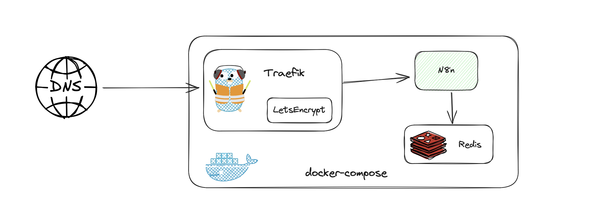

# n8n-with-docker-compose
Self-hosting n8n instances with docker-compose is easy.



## Getting started

This setup is made for self hosting n8n on a VPS with TLS certificates from LetsEncrypt.
Make sure that DNS records for your `auth.example.com`, `example.com` and `portal.example.com` point to your VPS.

Replace `example.com` with your domain.

```bash
docker-compose up -d 
```

## Authentication with Google OAuth

Create credentials in [Google Cloud](https://console.cloud.google.com/apis/credentials?inv=1&invt=AbrXRw), and add them to the file:

```bash
/var/data/config/traefik-forward-auth/traefik-forward-auth.env
PROVIDERS_GOOGLE_CLIENT_ID=
PROVIDERS_GOOGLE_CLIENT_SECRET=
SECRET=
AUTH_HOST=auth.example.com
COOKIE_DOMAINS=example.com
WHITELIST=me@example.com
```

## Monitoring N8N 

TO BE DONE
https://docs.n8n.io/hosting/logging-monitoring/monitoring/
